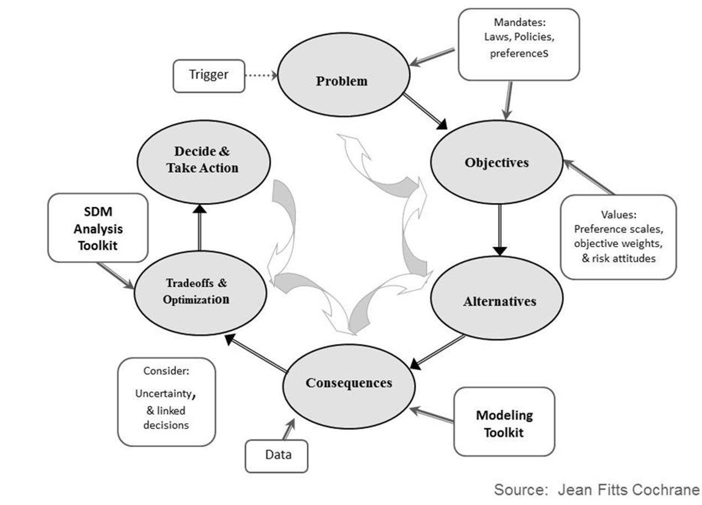

## NATR 8001: Decision Analysis for Research and Management of Natural Resources
### University of Missouri
### Location: 210 Anheuser-Busch Natural Resources building
### Time: Tuesdays, 2-4pm August 25-October 17 (first 8 weeks)
### Instructor: Dr. Brielle K Thompson

Natural resource management involves making difficult decisions. Familiar natural resource problems may include decisions on how many acres of land must be protected, how an endangered species should be reintroduced, whether an agency should conduct more monitoring of an invasive species. The decision analysis field offers tools like Structured Decision Making (SDM) to help frame, structure, and identify solutions for such problems. Various Federal and State fish and wildlife agencies are increasingly using SDM to ensure a streamlined, fair, unbiased, repeatable, transparent, and organized decision-making process.

This class will introduce Decision analysis/SDM and its key components (PrOACT): **Pr**oblem framing- describing the natural resource management problem; articulating **O**bjectives; developing management **A**lternatives; using forecasting tools to evaluate the **C**onsequences, or outcomes, of alternatives, and using **T**radeoff methods to identify management alternatives when decisions involve multiple competing objectives. 

Topics to be covered include decision structuring, influence diagramming, decision trees, optimization, multi-criteria decision analysis, value of information, and adaptive management.

Throughout the course the instructor will provide real-world case study examples and discuss how decision analysis may apply to graduate students’ projects. 
 

